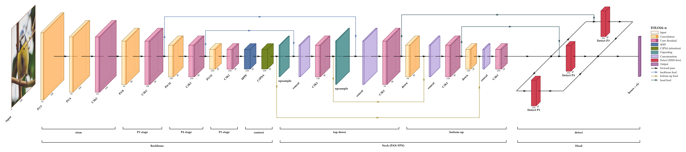
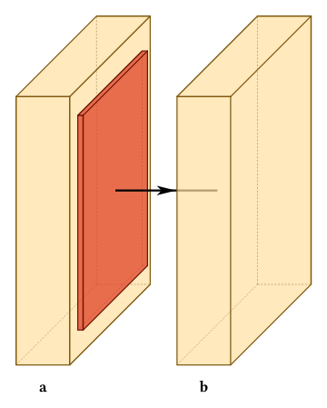
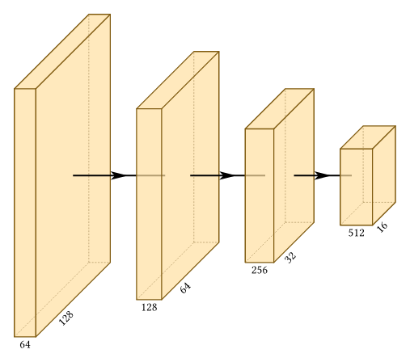
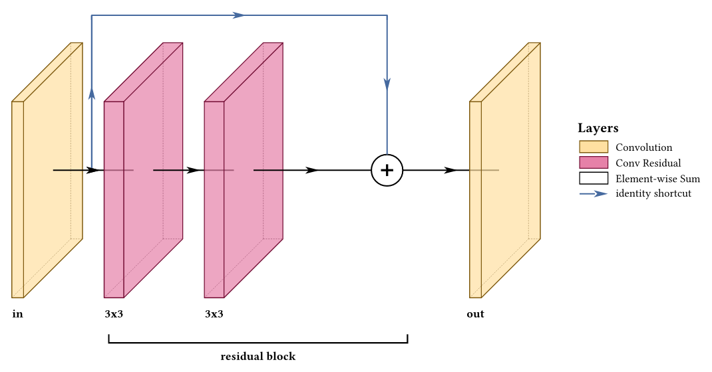
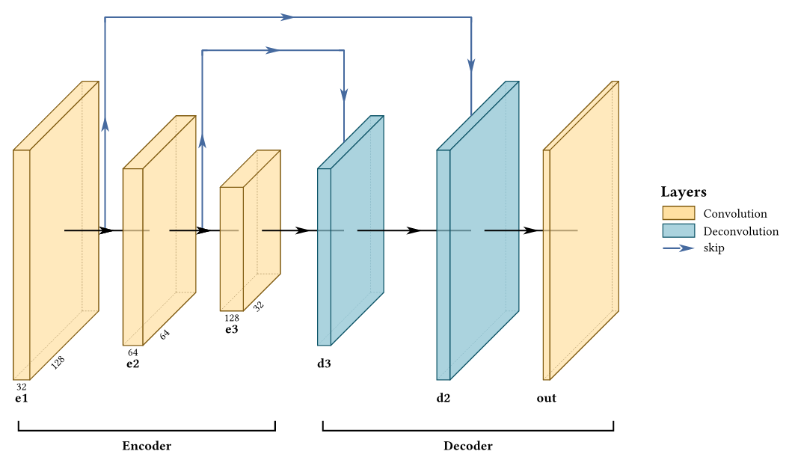
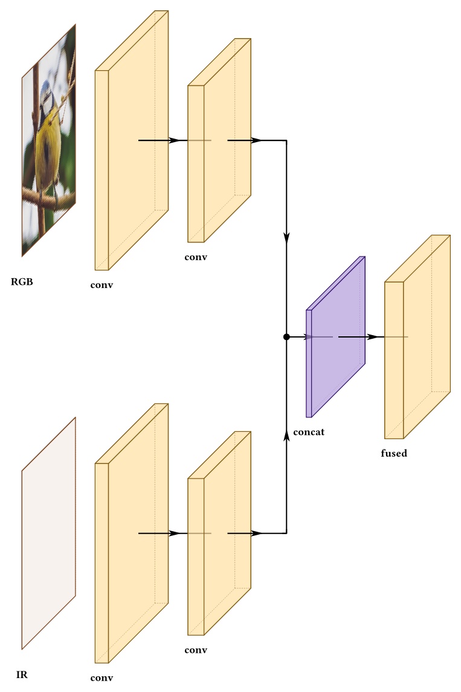
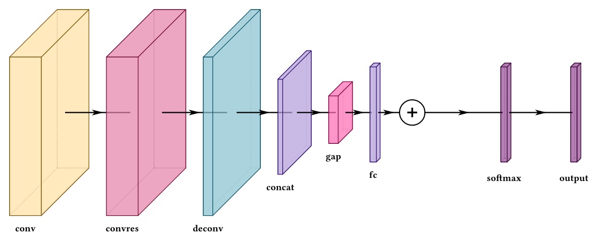
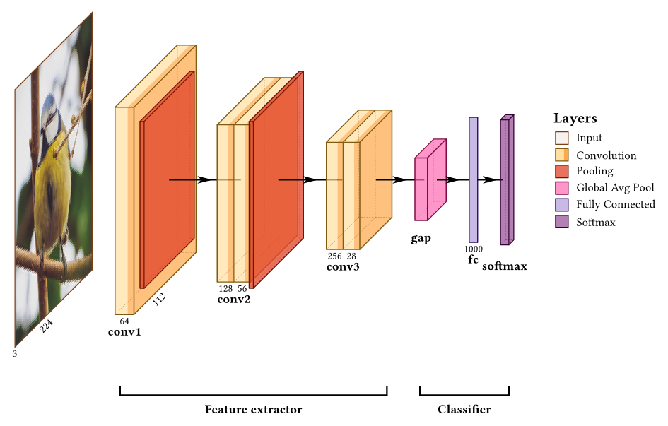
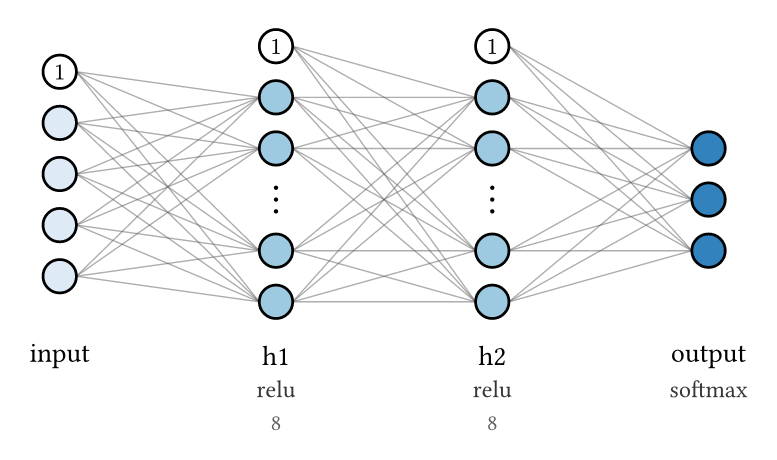
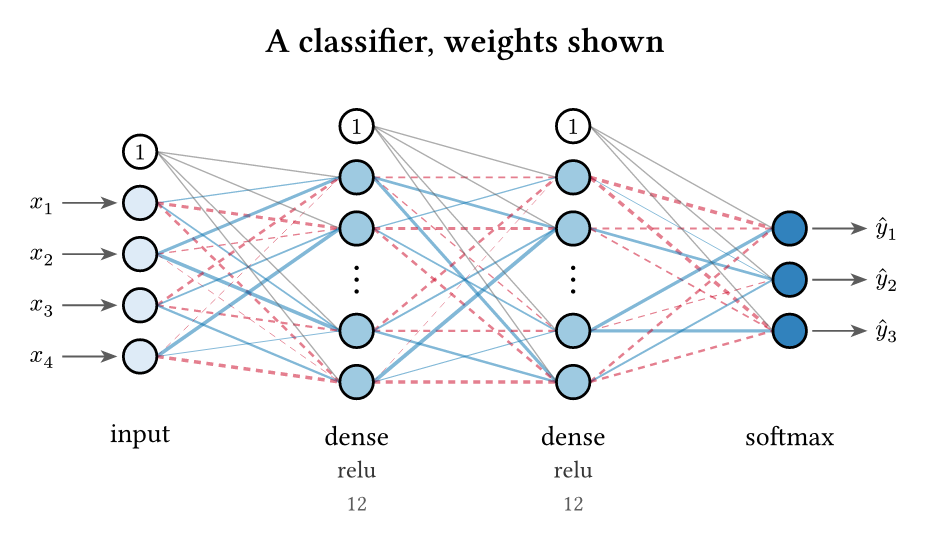

<h1 align="center">VINNT</h1>
<p align="center"><b>V</b>isual <b>I</b>llustration of <b>N</b>eural <b>N</b>etworks in <b>T</b>ypst</p>

<p align="center">

</p>

<p align="center">
<a href="doc/vinnt-manual.pdf"><b>user Manual</b></a> ·
<a href="gallery/"><b>Gallery</b></a> ·
<a href="examples/"><b>Examples</b></a>
</p>

Layered neural network architectures, drawn as isometric block diagrams — the
kind that open a paper's method section. Built on
[CeTZ](https://typst.app/universe/package/cetz/).

```typ
#import "@preview/vinnt:0.2.0": *
```

Requires Typst 0.15 or newer. Not yet on Typst Universe so you will have to point the
import at a local copy: `#import "path/to/src/lib.typ": *`.

---

## Start here

```typ
#draw-network((
  conv(label: "a"),
  pool(),
  conv(label: "b"),
))
```



## Blocks are sized from their tensor shapes

State what each layer produces and the geometry follows. Change a channel count
and the figure changes with it — there is no second copy of the pyramid to drift
out of step.

```typ
#draw-network((
  conv(shape: (64, 128, 128), channels: (64, 128)),
  conv(shape: (128, 64, 64), channels: (128, 64)),
  conv(shape: (256, 32, 32), channels: (256, 32)),
  conv(shape: (512, 16, 16), channels: (512, 16)),
))
```



Spacing, lane heights and arrival points are all computed too. Nothing above
sets an offset.

## Skips, sums and group brackets

```typ
#draw-network(
  (
    conv(name: "in", label: "in", widths: (0.3,)),
    convres(name: "c1", label: "3x3", widths: (0.5,)),
    convres(name: "c2", label: "3x3", widths: (0.5,)),
    sum(name: "add"),
    conv(name: "out", label: "out", widths: (0.3,)),
  ),
  connections: (
    (from: "in", to: "add", color: rgb("#466A9F"),
     legend: "identity shortcut"),
  ),
  groups: ((from: "c1", to: "add", label: "residual block"),),
  show-legend: true,
)
```



## Encoder–decoder

Routes land on the block itself with `touch-layer`, and stack into lanes by
how far they reach, so a longer skip always arcs over a shorter one.



## Genuinely parallel branches

Two-stream fusion, CSP interiors and multi-head detectors are drawn as they
are, not collapsed into one block with arrows pointed at it. Branches nest, and
may be open at either end.

```typ
#draw-network((
  branch(spread: 11, branches: (
    (input(label: "RGB", image: "default"), conv(shape: (32, 160, 160))),
    (input(label: "IR"), conv(shape: (32, 160, 160))),
  )),
  concat(label: "concat"),
  conv(label: "fused", shape: (128, 80, 80)),
))
```



## Fourteen layer types



Plus `custom`, which is the generic block you extend when you need something the
package has no name for:

```typ
#let attention(..a) = custom(fill: rgb("#466A9F"), width: 0.35,
                             legend: "Attention", ..a)
```

## A whole classifier



## Neuron diagrams

The other canonical figure — a circle per neuron, an edge per weight — is
`draw-mlp`, and zero configuration is publication-ready:

```typ
#draw-mlp((4, 6, 6, 3))
```

Per-layer control is constructors, like everything else in the package:

```typ
#draw-mlp((
  mlp-layer(4,  label: "input"),
  mlp-layer(8,  label: "h1", activation: "relu"),
  mlp-layer(8,  label: "h2", activation: "relu"),
  mlp-layer(3,  label: "output", activation: "softmax"),
), bias: true, cutoff: 6)
```



Wide layers collapse to an ellipsis with the true count badged beneath. Also
in the box: weight-driven edge color and thickness with negatives dashed by
default (explicit matrices, a function over indices, or seeded random), an
activation glyph catalog with the
softmax bracket, skip and recurrent edges with ⊕ merge nodes, bias nodes,
square and split node shapes, dropout and highlight node states, and a
bottom-to-top `direction: "up"`.



---

## Typos are errors, not silence

```
error: unknown layer option "hieght" on layer 3 (type "conv").
Did you mean "height"? Options accepted here: bandfill, channels,
connection-label, depth, fill, height, image, label, ...
```

Every option is checked against what that layer type actually reads, including
connection and group options and any name a connection points at. A key that is
quietly ignored produces a figure that is merely wrong, which reads as the
package being broken rather than as the typo it is.

## Import a model instead of drawing one

```bash
uv run tools/import_model.py --torchvision resnet18 -o resnet18.json
```

```typ
#draw-network(from-shapes(json("resnet18.json")))
```

<p align="center">

</p>

---

## Documentation

**[The manual](doc/vinnt-manual.pdf)** — 98 pages, 176 figures. Every option on
its own, several figures each, with the failure shown next to the fix. Every
figure in it is compiled from the code printed beside it. Build it with
`doc/build.sh`.

Writing VINNT with an LLM? Point it at [`doc/manual.typ`](doc/manual.typ) and
[`doc/examples/`](doc/examples/) rather than at the PDF. That is the manual's
actual source: plain text throughout, and every example a standalone file that
compiles on its own.

**[Gallery](gallery/)** — AlexNet, LeNet-5, VGG16/19, ResNet18, U-Net, FCN-8,
SynthMorph, YOLO26-n and five RGB-IR fusion variants, plus six MLP figures in
[`gallery/mlp/`](gallery/mlp/). Sources in [`examples/`](examples/).

- [YOLO26-n](gallery/networks/YOLO26n.png)
- [YOLO26-n — early fusion](gallery/networks/YOLO26n-early-fusion.png)
- [YOLO26-n — mid fusion](gallery/networks/YOLO26n-mid-fusion.png)
- [YOLO26-n — late fusion](gallery/networks/YOLO26n-late-fusion.png)
- [YOLO26-n — gated fusion](gallery/networks/YOLO26n-gated-fusion.png)
- [YOLO26-n — multiscale fusion](gallery/networks/YOLO26n-multiscale-fusion.png)
- [SynthMorph](gallery/networks/SynthMorph.png)

## Licence

MIT-0.

---

All due credit to prior work is provided in
[ACKNOWLEDGEMENTS.md](ACKNOWLEDGEMENTS.md).
